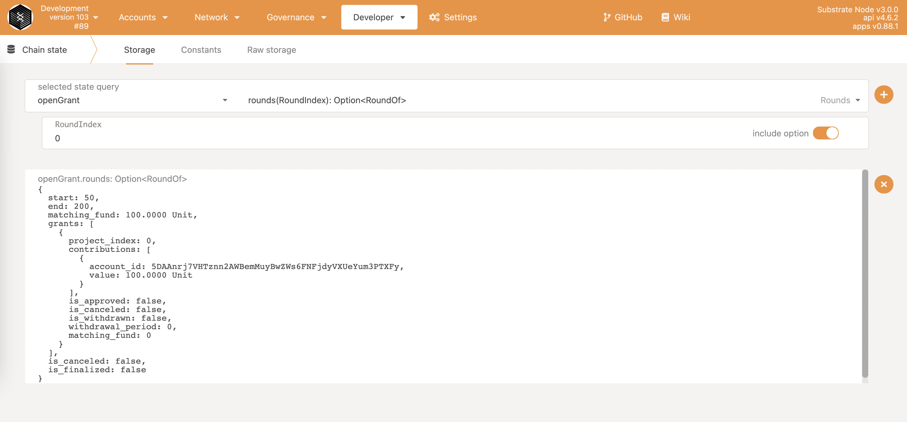

# Quadratic Funding Pallet

## Overview
This project is the delivery of the [Open Grant #268 - Quadratic Funding Module and Dapp Application](https://github.com/w3f/Open-Grants-Program/pull/268) and built on top of [Substrate Framework](https://github.com/substrate-developer-hub/substrate-node-template).

Quadratic Funding is a common short name for [Constrained Liberal Radicalism algorithm (referred to as CLR in this proposal)](https://blogchains.org/wp-content/uploads/sites/4/2019/04/SSRN-id3243656.pdf) proposed by Vitalik Buterin 2018, and is a crowdfund matching mechanism for public goods, like open source. The authors of the paper summaries the mathematical idea as below.

_"Individuals make public goods contributions to projects of value to them. The amount received by the project is (proportional to) the square of the sum of the square roots of contributions received."_

The mechanism is a concrete proposal for making grassroots donations something much larger by proportionately matching more towards small donations compared to large ones. It has been efficiently funding projects in the Web3 ecosystem. 

A user flow and simple demonstration of the application is shown using below UML sequence diagram. 

[User flow diagram on Lucid Chart](https://lucid.app/lucidchart/b9eb3034-1615-443c-9e8c-948cbfcecaf1/view)
## Getting Started

This section explains two way of running this project, with Rust environment and with Docker

### 1. Run in Rust environment
#### Rust Setup

Follow the [Rust setup instructions](./docs/rust-setup.md) before using the included Makefile to build the Node Template.

#### Makefile

This project uses a [Makefile](Makefile) to document helpful commands and make it easier to execute them. Get started by running these [`make`](https://www.gnu.org/software/make/manual/make.html) targets:

1. `make init` - Run the [init script](scripts/init.sh) to configure the Rust toolchain for    [WebAssembly compilation](https://substrate.dev/docs/en/knowledgebase/getting-started/#webassembly-compilation).
1. `make run` - Build and launch this project in development mode.

The init script and Makefile both specify the version of the [Rust nightly compiler](https://substrate.dev/docs/en/knowledgebase/getting-started/#rust-nightly-toolchain) that this project depends on.

#### Build

The `make run` command will perform an initial build. Use the following command to build the node without launching it:

```sh
make build
```
#### Run

The `make run` command will launch a temporary node and its state will be discarded after you terminate the process. After the project has been built, there are other ways to launch the node.

### 2. Run in Docker

First, install [Docker](https://docs.docker.com/get-docker/) and [Docker Compose](https://docs.docker.com/compose/install/).

Then run the following command to start a single node development chain.

```bash
./scripts/docker_run.sh
```

This command will firstly compile your code, and then start a local development network. You can
also replace the default command (`cargo build --release && ./target/release/node-template --dev --ws-external`)
by appending your own. A few useful ones are as follow.

```bash
# Run Substrate node without re-compiling
./scripts/docker_run.sh ./target/release/node-template --dev --ws-external

# Purge the local dev chain
./scripts/docker_run.sh ./target/release/node-template purge-chain --dev

# Check whether the code is compilable
./scripts/docker_run.sh cargo check
```

## Chain Setup
Functions in this pallet can be tested using single-node development chain mode, but if necessary developers can also set up multi-chain network as instructed below.
### A. Single-Node Development Chain

This command will start the single-node development chain with persistent state:

```bash
./target/release/node-template --dev
```

Purge the development chain's state:

```bash
./target/release/node-template purge-chain --dev
```

Start the development chain with detailed logging:

```bash
RUST_LOG=debug RUST_BACKTRACE=1 ./target/release/node-template -lruntime=debug --dev
```

### B. Multi-Node Local Testnet

If you want to see the multi-node consensus algorithm in action, refer to
[our Start a Private Network tutorial](https://substrate.dev/docs/en/tutorials/start-a-private-network/).

## Developer Documentation
Please refer to [Quadratic Funding Pallet](./docs/pallet-doc.md) documentations for development.

## Testing
End-to-end testing using Polkadot.js library to simulate developer experience from web application is used to test against code in this repo. All test code are in [quadratic-funding-test repo](https://github.com/OAK-Foundation/quadratic-funding-test). There are two types of test cases, unit tests and functional tests.

### Unit Testing
Unit testing is a method to test individual units of code separately. The purpose is to separate the smallest testable parts, in this case a Rust function, and verify if they function properly in isolation. 

Unit tests are categorized as below.

|Scenario|Number|
|:------:|:------:|
|approve|5|
|cancel|5|
|cancelRound|3|
|contribute|5|
|createProject|3|
|finalizeRound|2|
|fund|2|
|scheduleRound|10|
|withdraw|5|

### Functional Testing
In functional testing, a tester is to verify the output based on the user requirements with the expected output. The main objective of Functional Testing is to check the entire pallet and the networking interface – a simulation of an end-to-end development experience.

Functional tests are categorized as below.

|Scenario|Number|
|:------:|:------:|
|approve|7|
|cancel|7|
|cancelRound|3|
|contribute|4|
|finalizeRound|3|
|scheduleRound|2|
|withdraw|7|

#### Test Examples

##### 1. Text Accounts:

|Account|Identity|
|:------:|:------:|
|ALICE|Root|
|Bob|Project Owner|
|DAVE|Contributor|

##### 2. Prepare
1. Open the Polkadot.js Apps [(https://polkadot.js.org/apps/#/)](["https://polkadot.js.org/apps/#/"]) and connect to our pallet.
2. Add Additional Types to Polkadot.js Apps Settings.

	Click `Settings` -> `Developer`, and copy the below json content, than save and reload.
	
	```
	{
	  "ProjectIndex": "u32",
	  "ProjectOf": "Project",
	  "RoundIndex": "u32",
	  "RoundOf": "Round",
	  "Round": {
	    "start": "BlockNumber",
	    "end": "BlockNumber",
	    "matching_fund": "Balance",
	    "grants": "Vec<Grant>",
	    "is_canceled": "bool",
	    "is_finalized": "bool"
	  },
	  "Grant": {
	    "project_index": "ProjectIndex",
	    "contributions": "Vec<Contribution>",
	    "is_approved": "bool",
	    "is_canceled": "bool",
	    "is_withdrawn": "bool",
	    "withdrawal_expiration": "BlockNumber",
	    "matching_fund": "Balance"
	  },
	  "Contribution": {
	    "account_id": "AccountId",
	    "value": "Balance"
	  },
	  "Project": {
	    "name": "Vec<u8>",
	    "logo": "Vec<u8>",
	    "description": "Vec<u8>",
	    "website": "Vec<u8>",
	    "owner": "AccountId"
	  }
	}
	```
3. Transfer some values to `DAVE`.

	Click `Accounts`, select `ALICE`, and send 10000 units to `DAVE`.
	
	
	
4. Contribute 1000 units to fund pool.

	Click `Developer` -> `Extrinsics`, select the `ALICE` account, `quadraticFunding` pallet and `fund` method, input 1000 units, then submit.
	
	
	

##### 3. Examples

1. **Success test case with `contribute` functional**

	1. Create a new project by using `BOB` account.

		Click `Developer` -> `Extrinsics`, select the `BOB` account, `quadraticFunding` pallet and `createProject` method, input the project info, then submit.
	
		
	
		If success, you can get the project info by `Develop` -> `Chain State`, select `quadraticFunding` pallet and `projects` method, input `ProjectIndex` with `0`.
	
		
	
	2. Schedule a new round by using `ALICE` account.

		Click `Developer` -> `Extrinsics`, select the `ALICE` account, `sudo` pallet and `sudo` method, select `quadraticFunding.scheduleRound` call, input the new round info (`start` should large than currrent block, and `end` should large than `start`), then submit.
	
		
	
		If success, you can get the round info by `Develop` -> `Chain State`, select `quadraticFunding` pallet and `rounds` method, input `RoundIndex` with `0`.
	
		
	
	3. When the new round is active (current block > start and current block < end), using DAVE account to contribute 100 units to BOB's project (project_index is 0).

		
	
		If success, you can get the contribute info by `Develop` -> `Chain State`, select `quadraticFunding` pallet and `rounds` method, input `RoundIndex` with `0`.
	
		
	
2. **Fail test case with `withdraw` functional when the project owner (`BOB`) wants to withdraw a not approved project.**
	
    1. After the active round is ended (`end` > current block), finalize the ended round by using `ALICE` account.

    	Click `Developer` -> `Extrinsics`, select the `ALICE` account, `sudo` pallet and `sudo` method, select `quadraticFunding.finalizeRound` call, input the ended `RoundIndex` with `0`, then submit.

    	
    
    	If success, you can get the finalized round info by `Develop` -> `Chain State`, select `quadraticFunding` pallet and `rounds` method, input `RoundIndex` with `0`. You can find the `is_finalized ` is `true` now.
	
		
		
	2. Using `BOB` account to withdraw the project's fund.

		Click `Developer` -> `Extrinsics`, select the `BOB` account, `quadraticFunding` pallet and `withdraw` method, input the `RoundIndex` with `0` and `ProjectIndex` with `0`, then submit. After a while you can get an error, because if the project owner (`BOB`) wants to withdraw, he first needs the root account (`Alice`) appove his project.
		
		


3. **Success test case with `withdraw` functional**

	1. Approve `BOB`'s project by using `ALICE` account.

		Click `Developer` -> `Extrinsics`, select the `ALICE` account, `sudo` pallet and `sudo` method, select `quadraticFunding.approve` call, input the finalized `RoundIndex` with `0` and need approved `ProjectIndex` with `0`, then submit.
		
		
		
		If success, you can get the contribute info by `Develop` -> `Chain State`, select `quadraticFunding` pallet and `rounds` method, input `RoundIndex` with `0`. You can find the `is_approved` is `true` in `BOB`'s project now.
		
		
		
	2. Using `BOB` account to withdraw the project's fund.

		Click `Developer` -> `Extrinsics`, select the `BOB` account, `quadraticFunding` pallet and `withdraw` method, input the `RoundIndex` with `0` and `ProjectIndex` with `0`, then submit.
		
		
		
		If success, you can get the contribute info by `Develop` -> `Chain State`, select `quadraticFunding` pallet and `rounds` method, input `RoundIndex` with `0`. You can find the `is_withdrawn ` is `true` in `BOB`'s project now and can get other informations.
		
		